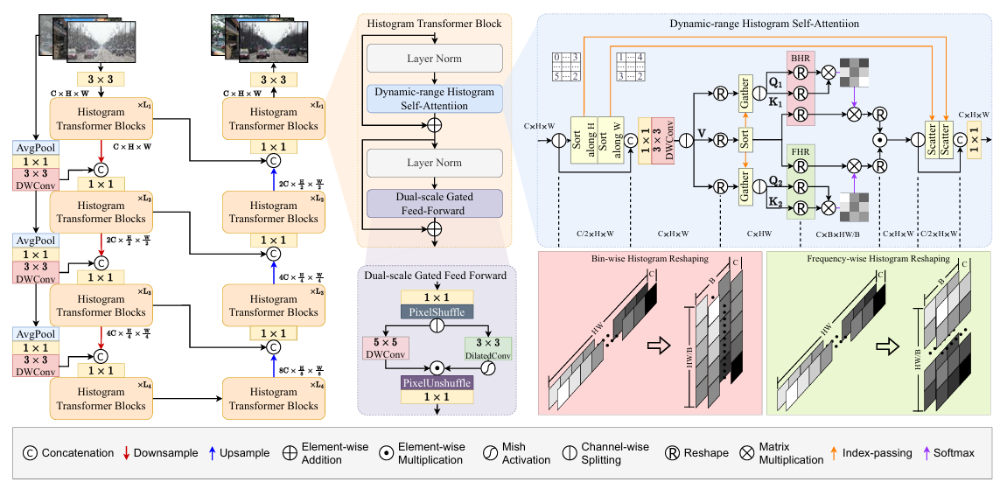
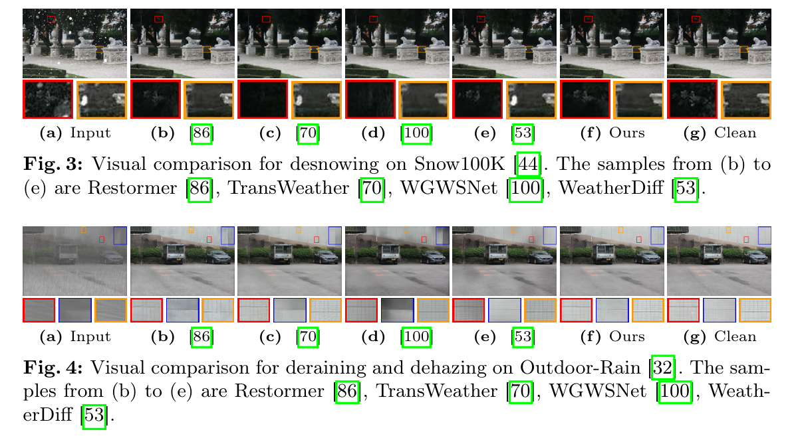

# 导语

随着大型语言模型（LLM）技术的飞速发展，其在各个领域的应用和影响日益深远。本期挑战期待大家分享关于 LLM 技术的最新研究成果、应用案例、创新思路以及对未来发展的展望，促进 LLM 技术的不断进步和广泛应用。

大语言模型（Large Language Models，简称LLM）是指那些通过深度学习技术训练出来的、拥有大量参数的自然语言处理（NLP）模型。这些模型通常基于变换器（Transformer）架构，能够理解和生成自然语言文本。以下是大语言模型的一些关键特点：

1. **参数规模大**：大语言模型拥有数亿甚至数千亿个参数，这些参数在训练过程中不断调整，以更好地理解和生成语言。
2. **预训练与微调**：这些模型通常先在大规模的数据集上进行预训练，学习语言的基本规律和知识，然后在特定任务上进行微调，以适应不同的应用场景。
3. **上下文理解**：大语言模型能够理解上下文信息，这对于语言理解任务（如文本分类、情感分析等）和语言生成任务（如文本生成、机器翻译等）至关重要。
4. **多任务学习**：由于其强大的语言理解能力，大语言模型可以被用于执行多种不同的NLP任务，而不需要为每个任务单独训练模型。
5. **知识整合**：大语言模型通过训练整合了大量的知识，这使得它们能够在回答问题或生成文本时提供更加丰富和准确的信息。
6. **持续进步**：随着技术的发展和更多的数据被用于训练，大语言模型的性能和能力在持续提升。

本文选择探讨大型语言模型（LLM）的Transformer架构技术原理，Transformer架构是由Vaswani等人在2017年提出的，主要用于处理序列到序列的任务，如机器翻译、文本摘要等。它的核心创新是自注意力机制（Self-Attention），这种机制使得模型能够处理序列中的长距离依赖问题，并且具有并行化处理的优势。

# Transformer架构的基础组件和概念

### 1. 编码器-解码器架构（Encoder-Decoder Architecture）

Transformer模型由编码器和解码器两部分组成。编码器处理输入序列（如一种语言的句子），解码器则基于编码器的输出生成目标序列（如另一种语言的句子）。

### 2. 自注意力机制（Self-Attention）

自注意力机制允许模型在处理序列的每个元素时，考虑序列中的所有位置，从而捕捉序列内部的依赖关系。这种机制通过计算序列中每个元素对其他所有元素的注意力权重来实现，这些权重反映了不同元素之间的相互关系。

### 3. 多头自注意力（Multi-Head Self-Attention）

Transformer模型使用多头自注意力来进一步增强模型的能力。这意味着模型不是只有一个自注意力层，而是有多个这样的层并行工作，每个层学习序列的不同表示子空间。

### 4. 位置编码（Positional Encoding）

由于Transformer本身并不具备处理序列顺序信息的能力，因此需要位置编码来提供这种信息。位置编码通常是固定的，并且与序列元素的嵌入向量相加，以确保模型能够理解单词的顺序。

### 5. 前馈神经网络（Feed-Forward Neural Network）

在每个自注意力层之后，Transformer使用一个前馈神经网络，这是一个简单的全连接层结构，用于进一步处理序列的表示。

### 6. 残差连接和层归一化（Residual Connection and Layer Normalization）

Transformer在自注意力层和前馈网络中使用残差连接，这意味着每个子层的输出会与输入相加，然后进行层归一化。这种设计有助于避免在深层网络中出现的梯度消失问题。

# 最新Histoformer

## 文章出处

* 题目：Restoring Images in Adverse Weather Conditions via Histogram Transformer

* 论文地址: https://arxiv.org/pdf/2407.10172

* 年份：2024
* 期刊：ECCV

## 背景

这篇文章提出了一个名为Histoformer的新型图像恢复方法，旨在解决由恶劣天气条件（如雨、雾和雪）引起的图像退化问题。具体来说，文章想要解决的问题包括：

1. **图像质量下降**：恶劣天气条件显著降低了图像的视觉质量，这对于需要清晰视觉信息的下游任务（如目标检测和深度估计）构成了挑战。
2. **现有方法的局限性**：早期的方法依赖于天气相关的先验知识来模拟退化的统计特性并去除恶劣天气。随后，卷积神经网络（CNNs）被提出用于处理去雨、去雾和去雪等任务，但这些方法需要为每个任务分别训练网络，并且在多个模型之间切换的复杂性给实际应用带来了挑战。
3. **Transformer-based方法的效率问题**：最近的基于Transformer的方法在去除恶劣天气的任务中显示出了超越CNNs的效率，但这些方法通常在内存利用上做出妥协，将自注意力操作限制在固定空间范围或仅在通道维度内，这限制了Transformer捕捉长距离空间特征的能力。
4. **长距离空间特征的捕捉**：文章指出，天气引起的退化因素主要导致类似的遮挡和亮度变化，这提示了需要一种能够有效捕捉长距离空间特征的方法来恢复图像。

## 文章创新点

* **直方图自注意力机制（Histogram Self-Attention, HSA）**：提出了一种名为“直方图自注意力”的新型机制。此机制通过根据像素强度对空间特征进行排序，并将其分配到不同的直方图区间（bins），实现了对具有相似特性的像素的有效分组。与传统自注意力机制受限于特定的空间范围或通道维度不同，HSA能够在更广泛的尺度上处理图像降质问题，尤其对于由天气因素导致的图像质量下降，其恢复效果显著优于现有技术。

* **动态范围卷积（Dynamic-Range Convolution）**：解决卷积神经网络在远距离空间特征提取方面存在的局限性，本文引入了动态范围卷积的概念。该技术通过对像素按照水平和垂直方向排序，允许卷积操作针对具有相近强度值的像素进行，从而加强了模型对天气条件下特定模式识别的能力。

* **双尺度门控前馈网络（Dual-scale Gated Feed-Forward Network, DGFF）**：基于常规前馈网络的基础上，设计了双尺度门控前馈网络。这一架构通过集成多层次及多范围的深度卷积操作，极大地提升了系统捕捉复杂场景下信息的能力，特别是对于需要跨多个尺度分析的任务而言，DGFF表现出了显著的优势。

* **皮尔逊相关系数损失（Pearson Correlation Coefficient Loss）**：为了提高恢复后图像与原始图像之间的线性相关性，本研究采用了皮尔逊相关系数作为额外的优化目标。这不仅保证了修复图像在视觉上与原图的高度一致，更重要的是，在全局层面维持了两者之间正确的相对位置和结构关系，超越了单纯追求像素级别精确度的传统方法。

  

## 方法分析

Histoformer模型采用了编码器-解码器架构，旨在通过结合动态范围直方图自注意力（DHSA）和双尺度门控前馈模块（DGFF）来实现图像恢复。该模型特别关注于恢复因天气条件引起的图像降质像素。具体来说，模型首先将输入的低质量图像$ I_{lq} \in \mathbb{R}^{3 \times H \times W} $通过一个3x3卷积层进行处理，以实现重叠图像补丁的嵌入。随后，编码器部分通过下采样提取多尺度特征，而解码器部分则通过上采样逐步重建出高质量的图像，同时利用跳跃连接（skip connections）来保持图像细节，增强训练过程的稳定性。

在Histoformer的网络主干中，直方图变压器模块（HTB）被用于提取复杂特征并捕获动态分布的退化因子。这些模块在编码器和解码器的各个阶段之间通过pixel-unshuffle和pixel-shuffle操作实现特征的下采样和上采样，确保了特征信息的有效传递和重建。此外，模型的损失函数结合了像素差异和皮尔逊相关系数，这不仅确保了恢复图像与真实图像在像素层面的一致性，还保证了它们在全局关系上的一致性。通过这种方式，Histoformer能够有效地恢复图像质量，尤其是在面对天气引起的图像降质时表现出色。下图是用于天气去除的 Histoformer 的整体架构。

###  基于动态范围直方图的自注意机制

动态范围直方图自我注意，旨在捕捉动态分布的天气诱导退化特征，通过将空间特征分割到多个直方图桶中，并在桶或频率维度上分配不同的注意力，从而选择性地关注具有动态范围的天气相关特征。这种设计的特点如何：

* **动态范围卷积**：输入特征被分为两个分支，对第一个分支的特征进行水平和垂直排序，然后与第二个分支的特征进行连接，再通过可分离的卷积。而传统的卷积操作使用固定大小的核，导致感受野范围有限，主要执行局部和小范围的计算。

* **直方图自我注意**：给定动态范围卷积的输出，将其分离成值特征（Value）和查询-键对（Query-Key pairs），然后根据值的索引对查询-键对进行排序和重组。与固定范围的自我注意不同，DHSA通过将空间元素分类到桶中，并在桶内或跨桶分配不同的注意力，以适应不同强度的背景特征和天气退化。

###  双刻度门控前馈

双刻度门控前馈，旨在丰富多范围特征的表示，以促进图像恢复过程。它通过集成两个不同的多范围和多尺度深度卷积路径来提取动态分布的天气诱导退化的相关信息。

其工作流程如下：

* 输入张量首先通过1x1点卷积操作来增加通道维度。
* 扩展后的张量被送入两个并行分支，其中一个分支使用5x5深度卷积，另一个分支使用扩张的3x3深度卷积。
* 通过门控机制，一个分支的输出在通过激活函数后作为另一个分支的门控图。

最终，双刻度门控前馈通过结合不同尺度的信息，增强了模型对多范围和多尺度特征的提取能力，从而提高了图像恢复的性能。

###  损失函数说明

文章中提到的损失函数包括重建损失（Reconstruction Loss）和相关损失（Correlation Loss），具体如下：

1. **重建损失（Reconstruction Loss）**：
   
   重建损失是衡量恢复图像与真实图像之间像素级差异的指标，使用的是L1范数，表达式为：
   $ L_{\text{rec}} = \left\| I_{\text{hq}} - I_{\text{gt}} \right\|_1 $,其中，$I_{\text{hq}} $是恢复后的高质量图像，$I_{\text{gt}} $是真实图像（ground-truth）。

2. **相关损失（Correlation Loss）**：
   
   相关损失是基于皮尔逊相关系数（Pearson correlation coefficient）来衡量恢复图像与真实图像之间的整体线性相关性。皮尔逊相关系数的计算公式为：
   $$
   rho(I_{\text{hq}}, I_{\text{gt}}) = \frac{\sum_{i=1}^{HW} (I_{\text{hq},i} - \bar{I}_{\text{hq}})(I_{\text{gt},i} - \bar{I}_{\text{gt}})}{\sqrt{\sum_{i=1}^{HW} (I_{\text{hq},i} - \bar{I}_{\text{hq}})^2} \sqrt{\sum_{i=1}^{HW} (I_{\text{gt},i} - \bar{I}_{\text{gt}})^2}}
   $$
   

   其中，$ I_{\text{hq},i} $和$ I_{\text{gt},i} $分别表示恢复图像和真实图像的第i个像素值，$\bar{I}_{\text{hq}} $和$\bar{I}_{\text{gt}} $分别表示恢复图像和真实图像的均值，$HW $表示图像的像素总数。相关损失的表达式为：
   $$
   L_{\text{cor}} = \frac{1}{2} \left( 1 - \rho(I_{\text{hq}}, I_{\text{gt}}) \right) 
   $$
   
   
   当恢复图像与真实图像完全相关时，$L_{\text{cor}} $为0。
   
3. **总损失函数（Total Loss）**：
   
   总损失函数是重建损失和相关损失的加权和，表达式为：
   $$
   L = L_{\text{rec}} + \alpha L_{\text{cor}} 
   $$
   
   
   其中，$\alpha $是相关损失的权重。
   
   
   
   文章中应用该方法后的对比效果如下所示：

# 我的想法

**图像标注与检索**：当使用LLM根据文本生成图片时，可以使用Histoformer更有针对性地恢复图像中的特定元素。

**上下文感知恢复**：将LLM用于理解图像的上下文信息，比如天气条件、场景类型等，然后将这些信息作为额外的上下文输入提供给Histoformer，以改善恢复效果。
