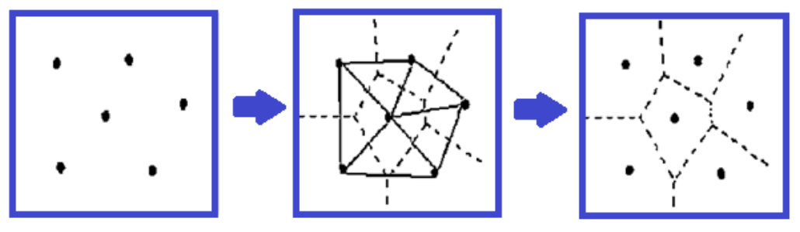
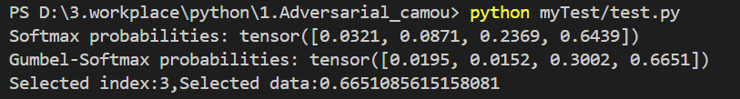
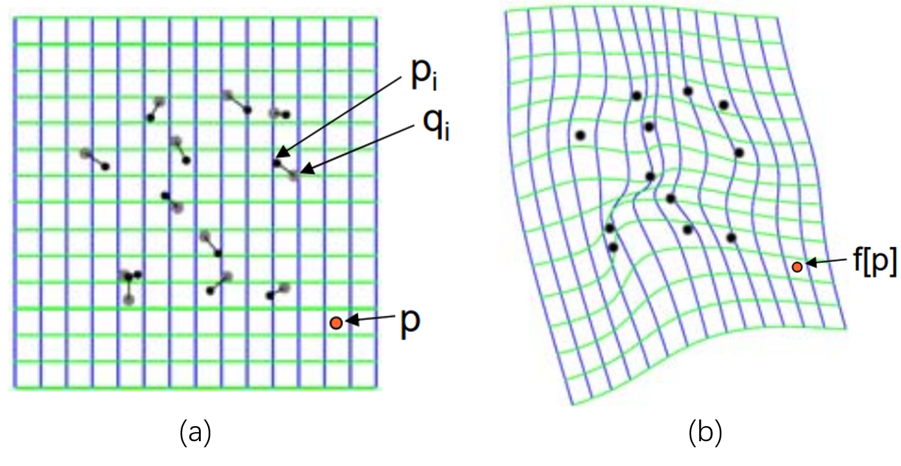

# 1、Voronoi diagram介绍

Voronoi图（Voronoi Diagram），也称为泰森多边形（Thiessen Polygons），是**一种将平面分割成多个区域的方法**，使得平面上任意一点到某个特定点（或一组点）的距离最近。这些特定点通常被称为生成点（generators）或种子点（seed points）。

维诺图是由一组由连接两邻点直线的垂直平分线组成的连续多边形组成。具备以下特点：

* 维诺图把平面划分成n个多边形域，每个多边形内只有一个生成元；
* 每个多边形内的点到该生成元距离短于到其它生成元距离；
* 多边形边界上的点到生成此边界的两个生成元的距离相等；
* 邻接图形的Voronoi多边形界线以原邻接界线作为子集;
* Voronoi图至多有2 * n - 5个顶点和3 * n - 6条边;
* 多边形内的生成元是形成三边的三点构成的三角形的外界圆圆心，而且所有的这些外界圆内部不含任何除这三点之外的顶点（空心圆特性）。

维诺图生成步骤：

建立泰森多边形算法的关键是对离散数据点合理地连成三角网，即构建Delaunay三角网。建立泰森多边形的步骤为：

1. 离散点自动构建三角网，即构建Delaunay三角网。对离散点和形成的三角形编号，记录每个三角形是由哪三个离散点构成的。
1. 找出与每个离散点相邻的所有三角形的编号，并记录下来。这只要在已构建的三角网中找出具有一个相同顶点的所有三角形即可。
1. 对与每个离散点相邻的三角形按顺时针或逆时针方向排序，以便下一步连接生成泰森多边形。设离散点为o。找出以o为顶点的一个三角形，设为A；取三角形A除o以外的另一顶点，设为a，则另一个顶点也可找出，即为f；则下一个三角形必然是以of为边的，即为三角形F；三角形F的另一顶点为e，则下一三角形是以oe为边的；如此重复进行，直到回到oa边。
1. 计算每个三角形的外接圆圆心，并记录之。
1. 根据每个离散点]的相邻三角形，连接这些相邻三角形的外接圆圆心，即得到泰森多边形。对于三角网边缘的泰森多边形，可作垂直平分线与图廓相交，与图廓一起构成泰森多边形。



# 2、Gumbel-Softmax介绍

`Gumbel-Softmax`算法并不是直接选取概率最大的值作为最终结果，而是通过一种称为“Gumbel-max 技巧”的方法来近似实现这一点。`Gumbel-Softmax` 算法通常用于生成离散分布的梯度，以便在神经网络中进行反向传播。

`Gumbel-Softmax` 提供了一种可微的近似，使可以在保持反向传播可行的情况下进行离散选择。通过`Gumbel-Softmax`，可以从离散分布中进行采样，并且保持梯度的传递。

### Softmax 函数
首先，`Softmax `函数将一组数值转换为概率分布。对于给定的数据  data = [1, 2, 3, 4] ，`Softmax `函数的计算公式为：

$$
p_i = \frac{e^{x_i}}{\sum_{j=1}^{n} e^{x_j}}
$$
其中 \( x~i~ \) 是输入数据中的第 i 个元素。

对于`data = [1, 2, 3, 4]`，计算得到的` Softmax `概率 \( p \) 为： p = [0.03, 0.08, 0.24, 0.65]

（注意：这里的概率值是近似值，实际计算时可能会有轻微的差异）

### Gumbel噪声

Gumbel噪声是一种从Gumbel分布中采样得到的噪声，它在机器学习和特别是深度学习中有着重要的应用，尤其是在处理离散随机变量和近似离散分布的梯度时。Gumbel分布是一种极值分布，常用于模拟一组独立同分布的随机变量中的最小值或最大值。

#### Gumbel分布

Gumbel分布是由德国数学家恩斯特·爱德华·库贝尔（Ernst Eduard Gumbel）提出的，它是一种连续概率分布，常用于描述极端事件。Gumbel分布的概率密度函数（PDF）和累积分布函数（CDF）如下：

- **概率密度函数 (PDF)**:
  $$
  f(x; \mu, \beta) = \frac{1}{\beta} \exp \left( -\left( \frac{x - \mu}{\beta} + e^{-\frac{x - \mu}{\beta}} \right) \right)
  $$
  
  其中，$\mu $是位置参数，$\beta$ 是尺度参数。
  
- **累积分布函数 (CDF)**:
  $$
  F(x; \mu, \beta) = \exp \left( -e^{-\frac{x - \mu}{\beta}} \right)
  $$

 #### Gumbel噪声的生成

在实际应用中，我们通常使用Gumbel分布的CDF的逆函数来生成Gumbel噪声。具体步骤如下：

1. **生成均匀分布的随机数**：
   - 从均匀分布  U(0,1)  中采样一个随机数 u 。

2. **应用Gumbel分布的逆CDF**：
   - 使用公式 $$ g = -\log(-\log(u))$$ 来生成Gumbel噪声。这个公式实际上是Gumbel分布的CDF的逆函数。

### Gumbel-Softmax 函数
`Gumbel-Softmax `函数通过引入 `Gumbel `噪声来近似离散分布。其计算公式为：
$$
y_i = \frac{\exp((\log(p_i) + g_i) / \tau)}{\sum_{k=1}^{K} \exp((\log(p_k) + g_k) / \tau)}
$$
其中  g ~i~是从` Gumbel `分布中采样的噪声， tau是温度参数。

### Gumbel-Softmax 的实现步骤
1. **Softmax 计算**：首先计算` Softmax` 概率。`Softmax`函数可以将一个实数向量转换为一个概率分布，其公式为：$\text{Softmax}(p_i) = \frac{\exp(p_i)}{\sum_{j} \exp(p_j)}$ ，其中pi是模型输出的第 *i* 个类别的对数概率。
2. **Gumbel 噪声**：为每个概率值添加 `Gumbel `噪声。
3. **Gumbel-Softmax 计算**：将`Gumbel`噪声添加到`Softmax`概率中，然后再次应用`Softmax`函数。这一步的目的是将连续的`Softmax`概率转换为离散的分布，同时保持梯度信息以供反向传播使用。`Gumbel-Softmax`的公式为： $y_i = \frac{\exp\left(\frac{\log p_i + g_i}{\tau}\right)}{\sum_{j} \exp\left(\frac{\log p_j + g_j}{\tau}\right)}$,其中 *τ* 是温度参数，控制分布的“软度”。当 *τ* 趋向于0时，分布趋向于离散的one-hot编码。
4. **选择最大值**：在` Gumbel-Softmax `值中选择最大的值。

### 示例代码
下面是一个 Python 示例，使用 PyTorch 实现 Gumbel-Softmax：

```python
def test_gumbel_softmax():
    """Gumbel-Softmax 分布"""
    import torch
    import numpy as np

    def gumbel_softmax(logits, temperature=1.0):
        # 使用 torch.rand_like(logits) 生成一个与输入 logits 形状相同的张量，其中的元素是从均匀分布U(0,1)中采样得到的
        gumbel_noise = -torch.log(-torch.log(torch.rand_like(logits) + 1e-10))
        y = logits + gumbel_noise
        y = torch.softmax(y / temperature, dim=-1)
        return y

    data = torch.tensor([1.0, 2.0, 3.0, 4.0])
    # 利用公式将数据转化成概率 p(i) = exp(z_i) / sum_j(exp(z_j))
    probs = torch.softmax(data, dim=0)
    gumbel_probs = gumbel_softmax(data, temperature=1.0)
    print("Softmax probabilities:", probs)
    print("Gumbel-Softmax probabilities:", gumbel_probs)

    # 选择 Gumbel-Softmax 中概率最大的值
    max_data, max_index = torch.max(gumbel_probs, dim=0)
    print(f"Selected index:{max_index.item()},Selected data:{ max_data.item()}")


if __name__ == "__main__":
    test_gumbel_softmax()

```



### 结果解释

- **Softmax 概率**：计算得到的概率分布。
- **Gumbel-Softmax 概率**：在 Softmax 概率基础上添加 Gumbel 噪声并重新计算。
- **选择最大值**：从 Gumbel-Softmax 概率中选择概率最大的值的索引。

这个过程并不是简单地选择概率最大的值，而是通过引入噪声来近似实现这一点，使得在梯度下降过程中可以处理离散变量。

# 3、TPS(Thin Plate Spline)介绍

薄板样条插值（Thin Plate Spline,TPS）解决的问题是：给定两张图片a,b中一些相互对应的控制点，如何将其中图片a进行特定的形变，使得其控制点可以与图片b的控制点重合。



# 4.拓扑合理投影（TopoProj）和几何合理投影（GeoProj）

## 拓扑合理投影（TopoProj）

1. **定义**：
   - 拓扑合理投影（TopoProj）是一种**基于拓扑关系的纹理映射技术**。在这种投影中，纹理图是根据三维模型表面的拓扑结构进行映射的，确保了模型表面上的拓扑关系（如邻接性）在纹理图上得以保持。
2. **特点**：
   - **拓扑关系保持**：在TopoProj中，即使在二维纹理图上不相邻的点，如果它们在三维模型上是相邻的，这种邻接关系也会在纹理图上得以保持。
   - **变形适应性**：由于它考虑了模型的拓扑结构，因此在模拟衣物或其他柔性物体的变形时更为有效，能够生成更加自然和真实的纹理变形效果。
   - **增强泛化能力**：通过保持拓扑关系，TopoProj有助于提高纹理图案在不同变形和视角下的泛化能力。

## 几何合理投影（GeoProj）

1. **定义**：
   - 几何合理投影（GeoProj）是一种**基于几何距离的纹理映射技术**。在这种投影中，纹理图（texture map）是根据三维模型表面的几何形状进行映射的，确保了模型表面上的局部距离在纹理图上得以保持。
2. **特点**：
   - **局部距离保持**：在GeoProj中，三维模型上相邻顶点（vertices）之间的距离在纹理图上得以保持，这有助于保持纹理图案的局部细节和比例。
   - **直观性**：由于它基于几何形状，因此生成的纹理图直观且易于理解。
   - **打印和裁剪友好**：GeoProj生成的纹理图适合直接打印和裁剪，因为它们与实际的物理尺寸和形状直接对应。

# 5、EOT(Expactation Over Transformation)介绍

“Expectation Over Transformation (EOT)” 是一项用于生成鲁棒对抗性样本的算法，旨在确保生成的对抗性样本在多种变换下仍然能够保持其对抗性。

### 核心思想

EOT 的核心思想是将对抗性样本的生成视为一个期望值优化问题。具体来说，EOT 通过以下步骤实现：

- **建模变换**：定义一个变换分布 *T*，其中包含了可能影响输入图像的各种变换（如旋转、平移、缩放等）。
- **优化目标**：在优化过程中，EOT 不是仅仅优化单个输入样本，而是优化在变换分布下的期望值。目标是最大化目标类的对数似然，同时最小化对抗样本与原始样本在变换后的感知距离。

###  数学公式

EOT 假设输入 x 可以经过某种随机变换 T((x)，例如旋转、缩放、加噪声等，我们要做的是通过多种不同的变换 T 生成一个期望损失的目标。EOT 的优化问题可以表示为：
$$
arg~max_{x^′}E_{t∼T}[log⁡P(y_t∣t(x^′))]
$$
其中：

- *x*′ 是待优化的对抗性样本。
- *y~t~* 是目标类。
- *t*(*x*′) 是经过变换 *t* 后的对抗性样本*x'*。

（等式解释： 等式的目标是找到一个对抗性样本 *x*′，使得在所有可能的变换 *t* 下，模型将其误分类为目标类别 *y~t~* 的置信度的期望值最大化。）

同时，约束条件是：
$$
E_{t∼T}[d(t(x^′),t(x))]<ϵ , x∈[0,1]^d
$$
这里 *d* 是输入之间的距离函数，*ϵ* 是允许的扰动范围。$$[0,1]^d$$：表示一个 *d*-维空间，其中每个维度都被限制在 [0,1]区间内。


扰动的定义：
$$
\delta = E_{t∼T}[d(t(x^′),t(x))]
$$
其中，d(·,·)是一个距离计算函数。

### 优化过程

在实际优化中，EOT 采用随机梯度下降（SGD）方法。具体步骤包括：

1. **采样变换**：在每次梯度下降迭代中，从变换分布 *T* 中随机采样变换 *t*。
2. **计算梯度**：通过链式法则计算期望值的梯度，利用采样的变换来更新对抗性样本。
3. **更新样本**：根据计算出的梯度更新对抗性样本 *x*′。

针对数学公式部分有优化过程解释：

1. **初始化**: 从一个正常样本 *x* 开始，生成一个微小扰动并添加到 *x*′。
2. **迭代优化**:
   - 在每次迭代中，从变换分布 *T* 中随机采样多个变换 *t*。
   - 对每个采样的变换 *t*，计算扰动样本 *t*(*x*′) 下，模型对目标类别 *y~t~* 的预测概率 *P*(*y~t~*∣*t*(*x*′))。
   - 计算这些概率的对数的期望值，并通过梯度上升方法更新 *x*′，使得这个期望值最大化。
3. **约束**: 在更新 *x*′ 的同时，需要确保 *x*′ 与原样本 *x* 之间的差异在一定的范围内，以保证对抗性样本的不可见性。

（梯度上升：用于寻找函数的局部最大值，与梯度下降（Gradient Descent）相对，梯度上升的目标是通过更新参数来增加目标函数的值。）
